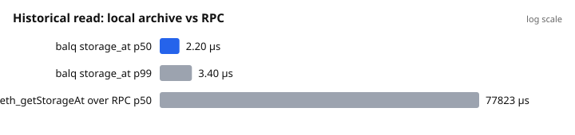
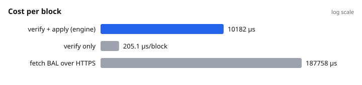
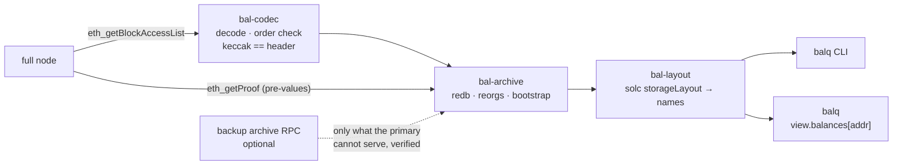

# balq — BAL query

[](https://github.com/artemmartyhin/balq/actions/workflows/ci.yml)
[](https://github.com/artemmartyhin/balq/actions/workflows/bal-node.yml)
[](https://crates.io/crates/balq)
[](https://www.npmjs.com/package/@balq/node)


**Local, verified history of any contract's storage — on a full node, no
archive node, no indexer schema.** Built on EIP-7928 Block-Level Access
Lists (Glamsterdam).

```
balq watch 0x3582… --from 114563          # start following a contract
balq sync  --rpc http://localhost:8545 --follow
balq get   0x3582… --layout Playground.json --field "balances[0x61Cc…]" --block 114591
→ balances[0x61Cc…] = 37585   (slot 0xc0e2…, set @ 114590, bal)
```

```js
const view = archive.view(proxy, layout).at(114591);   // balq
view.balances[addr]   // 37585n  — reads like the contract, at any block
```

## Why this could not exist before Glamsterdam

Before EIP-7928, "which storage slots changed in this block" lived only
inside the node while it executed the block. To get it you either replayed
blocks with a debug tracer (expensive, client-specific, unverifiable),
trusted the contract's events (only what the author chose to log), or ran an
archive node and asked slot by slot (15 TB, and you must already know which
slots to ask for).

EIP-7928 puts the complete list of changed slots and their post-values
**into the block**, and its hash into the header, under consensus. That
turns "what changed" from a node's opinion into a fact of the block —
complete by rule, verifiable with one keccak. balq is the tool that
accumulates that fact, verifies it, and answers by variable name.

## Three promises

1. **Completeness.** If a slot is not in the BAL, it did not change. Not
   "probably": a block with an incomplete BAL is invalid.
2. **Verifiability.** Every stored value is checked — the BAL against the
   header hash, bootstrap values by Merkle proof against `state_root`. Every
   record carries its provenance.
3. **Definite boundaries.** A read returns a value or a typed reason it is
   unavailable. Never a silent zero.

The node is trusted for exactly one thing: which block is canonical.

## Compared with the alternatives

| | Event indexers (Ponder, Envio, Subsquid) | Archive node / provider | Tracing (`debug_traceBlock`) | **balq** |
|---|---|---|---|---|
| What you see | what the author logged | any slot, if you know which | full diff | **every slot, incl. `private`** |
| Completeness | trust the provider's logs | n/a | trust the tracer | **by construction (consensus)** |
| Verification | none | none | none | **keccak vs header, Merkle vs stateRoot** |
| Runs on | anything | 15 TB node or a paid API | archive-grade node | **1–2 TB full node** |
| New question | new schema, reindex | new RPC calls | re-trace | **same file, new query** |
| Historical read | ms (DB) | 50–500 ms (RPC) | seconds | **~2 µs (local seek)** |
| Best at | "what happened" | ad-hoc reads | debugging one tx | **"what state was it in at block N"** |

Indexers are the layer *above* balq, not a competitor: their handlers can
read historical state from balq instead of an archive node.

## Measured (Platåberget, 2026-08-29)

`balq bench --rpc https://rpc.plataberget.ethpandaops.io --blocks 300 --top 20`
— catch-up sync of the 300 latest blocks for the 20 most-written addresses
on the network, release build, laptop, public gateway over HTTPS.
Full tables and method: [`docs/BENCH.md`](docs/BENCH.md).





| | value |
|---|---:|
| historical read, p50 / p99 | **2.2 µs / 3.4 µs** |
| same reads via `eth_getStorageAt`, p50 | 77.8 ms |
| verify one block (keccak of a 215-account BAL) | 0.2 ms |
| apply one block, 20 addresses, ~140 records | 10 ms |
| engine throughput, BALs in memory | 98 blocks/s |
| `eth_getStorageAt` vs archive, 30 control samples | 0 mismatches |
| on-disk cost per record (three indexes, redb) | 417–540 B |

The last line is the honest one: the design estimate was ~90 B/record.
Reducing it is tracked, not hidden.

## How it works



- **Keys** `addr ‖ slot ‖ block ‖ index` — a historical read is one ordered
  seek and a step back. A block index makes `diff` and rollback O(changed).
- **Bootstrap.** BALs carry post-values only. The value *before* a slot's
  first change comes from `eth_getProof` at `C-1`, verified against
  `state_root`; a slot that never changed is proven at the head. Both
  distinguish "zero" from "absent".
- **Reorgs.** Parent hashes are checked per block; a fork rolls back through
  the block index. Proofs taken on an orphaned branch are dropped.
- **Provenance.** Every value is tagged `bal`, `proof`, or (opt-in only)
  `unverified` / `imported`.

## Install

```
cargo install balq          # CLI, from crates.io
npm i @balq/node            # Node bindings, prebuilt for win32-x64 · linux-x64 · linux-arm64 · darwin-x64 · darwin-arm64
```

## Packages

| Registry | Package | What |
|---|---|---|
| crates.io | [`balq`](https://crates.io/crates/balq) | the CLI |
| crates.io | [`bal-archive`](https://crates.io/crates/bal-archive) | the archive: store, sync, reorgs, bootstrap — use this from Rust |
| crates.io | [`bal-layout`](https://crates.io/crates/bal-layout) | solc `storageLayout` → slots and typed values |
| crates.io | [`bal-source`](https://crates.io/crates/bal-source) | node access: traits, JSON-RPC, proof verification, primary+backup |
| crates.io | [`bal-codec`](https://crates.io/crates/bal-codec) | EIP-7928 wire format only |
| npm | [`@balq/node`](https://www.npmjs.com/package/@balq/node) | Node.js bindings — `Archive`, `Layout`, `view()`; the platform binaries are its `optionalDependencies` |

Rust: `cargo add bal-archive bal-layout` — docs on [docs.rs](https://docs.rs/bal-archive).

## Use

```
balq probe   --rpc <url>                                   # does this node serve BALs? proof window?
balq watch   <addr> --from <head+1>                        # storage lives at the proxy, layout at the impl
balq sync    --rpc <url> --follow [--backup-rpc <archive>] [--proof-window N]
balq get     <addr> --slot 0 --block N [--rpc <url>]       # raw; --rpc proves a never-changed slot
balq get     <addr> --layout C.json --field totals.index --block N
balq diff    <addr> --from A --to B [--layout C.json]      # names where possible, [raw] where not
balq history <addr> --slot 0 --range A..B
balq verify  --journal rows.jsonl                          # archive vs. rows you know are true
balq typegen C.json --name CView > C.d.ts                  # TypeScript for the Node view
balq bench   [--rpc <url>] [--out docs/bench]              # the numbers above
balq completions bash > /etc/bash_completion.d/balq      # zsh, fish, powershell too
```

Every command takes `--json` for scripts (a miss is `{"error":{"code":"BootstrapLost",…}}`
with exit code 2, never a zero). Defaults for `--rpc`, `--backup-rpc`,
`--proof-window` and `--data` can live in `balq.toml`. Run it as a service with
`deploy/balq.service` or the `Dockerfile`; common errors are explained in
[`docs/FAQ.md`](docs/FAQ.md).

The layout is the `storageLayout` from your compiler (`forge inspect C
storageLayout`, or a forge/hardhat artifact) — not the ABI.

### Node

```js
const { Archive, Layout, NotAvailableError } = require("@balq/node");
const ar = Archive.open("./balq.redb", { proofWindow: 0 });
ar.watch(proxy, 114563);
await ar.sync(rpcUrl, true, backupRpc);              // reads keep working meanwhile

const layout = Layout.fromFile("out/Playground.sol/Playground.json");
const v = ar.view(proxy, layout).at(114591);
v.counter; v.balances[addr]; v.totals.index; v.items[3]; v.items.length;   // bigint / boolean / string
try { ar.view(proxy, layout).at(1).counter } catch (e) { e.code }          // "BeforeStart", never undefined
```

## What a read can say instead of a value

| code | meaning |
|---|---|
| `BeforeStart` | before you started watching — history is forward-only |
| `AfterHead` | sync has not reached that block yet |
| `NotBootstrapped` | never changed since start; pass `--rpc` to prove it now |
| `BootstrapPending` | first change recorded, proof still to come |
| `BootstrapLost` | the node's proof window passed first (public gateways: window 0) — a `--backup-rpc` prevents this |

## Limits, stated

- **Forward-only.** No history before `watch`; backfill is a separate,
  unbuilt mechanism.
- **Proof window.** A public gateway serves proofs only at the head; the
  value before a slot's first change then needs `--backup-rpc` or an own
  node with `--rpc.eth-proof-window N`. Post-values are never affected.
- **Mappings** cannot be enumerated (keccak is one-way); reading a known key
  works, "list all holders" does not.
- **Not yet:** header self-hash check, `subscribe()` stream, ERC-7201 /
  Diamond layouts, long `bytes`/`string`.
- **EIP-7928 is in Review.** The wire format lives in one crate and is pinned
  by a known-answer test against a real block; a spec change touches one file
  and fails that test first.

## Repository

```
crates/            bal-codec · bal-source · bal-archive · bal-layout · bal-cli · bal-node
docs/              SPEC.md · DECISIONS.md · BENCH.md · SECURITY-AUDIT.md · bench/
testbed/           own contract on Platåberget + journal = ground truth for `verify` (96/96)
.github/           ci: fmt · clippy · rustdoc · tests on 3 OSes · MSRV · live probe; npm prebuilds
```

MSRV 1.90. Workspace lints: `missing_docs`, `unwrap_used`, `unsafe_code = deny`.
`CHANGELOG.md` · `CONTRIBUTING.md` · `SECURITY.md` · MIT OR Apache-2.0.
